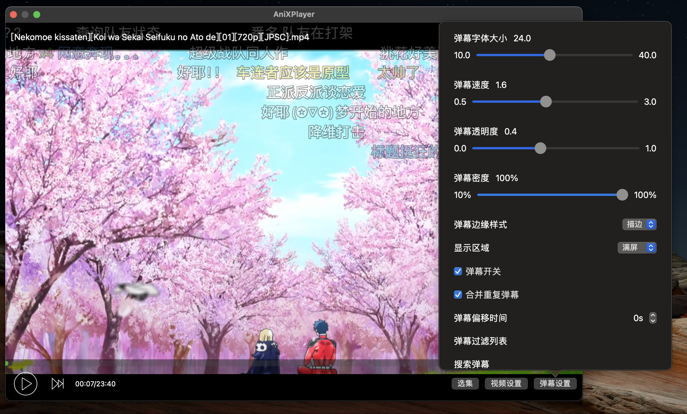
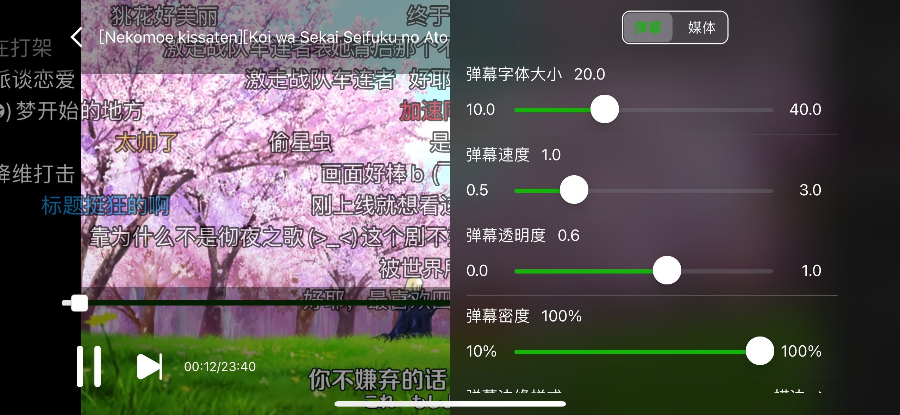

# AniXPlayer

弹弹Play iOS+Mac版，包含基础播放、设置等功能   
（你问我为啥叫这个名？当然是群友选的

## 安装
1. clone 项目
2. pod install
3. 如果需要支持登录等功能，在`AppKey.swift`中配置你的`appId`和`appSec`
    > 可加QQ群: 493974192，找群主申请

## 截图
### Mac

### iOS

