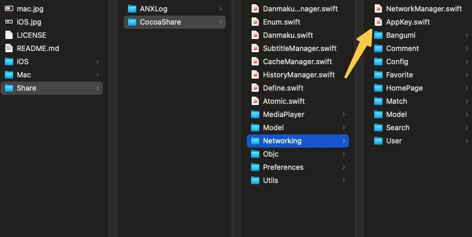
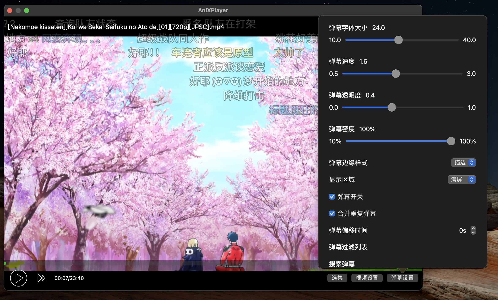
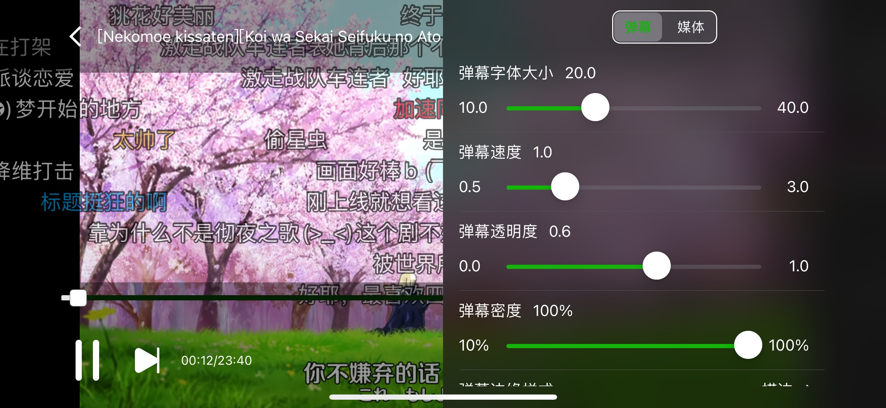

# AniXPlayer

弹弹Play iOS+Mac版，包含基础播放、设置等功能   
> 你问我为啥叫这个名？当然是群友选的

## 安装
1. clone 项目
2. pod install
3. 在下图目录中创建`AppKey.swift`文件，内容如下（AppKey申请方式：[点我跳转](https://doc.dandanplay.com/open/)）：
```
AppKey.swift：

struct AppKey {
    static var appId = "xxxxx"
    static var appSec = "xxxxx"
}
```



## 截图
### Mac


### iOS

